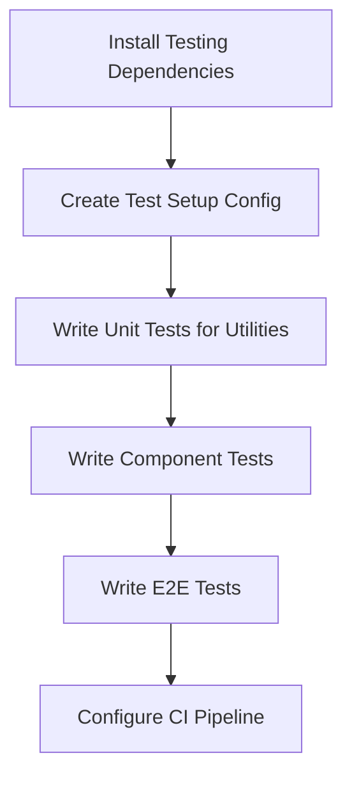

# Character Tools - Improvement Suggestions

## Overview

This document outlines suggested improvements for the Character Tools application, organized by priority and category.

---

## High Priority Improvements

### 1. Testing & Quality Assurance

#### Current State
- No test files detected in the codebase
- Limited type safety with `any` types present
- No automated testing pipeline

#### Suggested Actions
- Set up **Vitest** for unit testing
- Add **React Testing Library** for component testing
- Implement **Playwright** for E2E testing
- Replace `any` types with proper TypeScript interfaces
- Add test coverage reporting

#### Implementation Steps

---

### 2. Error Handling & User Experience

#### Current State
- Limited error boundaries
- Basic error messages without actionable feedback
- No loading states for async operations

#### Suggested Actions
- Add **React Error Boundaries** to prevent app crashes
- Implement **global error handler** with logging
- Add **loading skeletons** for async operations
- Create **user-friendly error messages** with recovery options
- Add **undo/redo** functionality for editors

---

### 3. Performance Optimizations

#### Current State
- Tokenizers are code-split but loaded eagerly
- No virtual scrolling for large lists
- No memoization optimizations

#### Suggested Actions
- Implement **lazy loading** for tokenizers
- Add **Web Workers** for heavy operations (image processing, tokenization)
- Use **react-window** or **react-virtualized** for large lists
- Add **React.memo**, **useMemo**, **useCallback** where appropriate
- Implement **service worker** for caching

---

## Medium Priority Improvements

### 4. Accessibility (a11y)

#### Current State
- Limited ARIA labels
- Keyboard navigation not fully implemented
- No focus management for modals

#### Suggested Actions
- Add **ARIA labels** to all interactive elements
- Ensure **keyboard navigation** works throughout
- Implement **focus management** for modals and dialogs
- Test with **screen readers**
- Add **high contrast mode** support

---

### 5. Search & Filtering

#### Current State
- Basic table display without advanced search
- No filtering capabilities
- Limited sorting options

#### Suggested Actions
- Implement **full-text search** for characters and books
- Add **filter by tags** with autocomplete
- Add **sort by multiple criteria**
- Implement **saved searches**
- Add **quick filters** (recently used, favorites)

---

### 6. Version History & Backup

#### Current State
- No version tracking
- Manual database export/import only
- No automated backups

#### Suggested Actions
- Implement **version history** for characters and books
- Add **restore capability** for previous versions
- Create **automated backups** with configurable intervals
- Add **cloud storage integration** (optional)
- Implement **diff/merge** capabilities

---

### 7. Code Organization

#### Current State
- Some large component files
- Direct Dexie calls throughout components
- Limited code reuse

#### Suggested Actions
- Split large components into smaller, reusable pieces
- Create **API layer** to abstract database operations
- Extract **common UI patterns** into shared components
- Add **JSDoc comments** for complex functions
- Implement **feature-based folder structure**

---

## Low Priority Improvements

### 8. Internationalization (i18n)

#### Current State
- English only
- Hardcoded strings throughout

#### Suggested Actions
- Add **i18next** for internationalization
- Extract all strings to translation files
- Implement **language switcher**
- Add **RTL support** for Arabic/Hebrew

---

### 9. Dark Mode

#### Current State
- Uses MUI theme system
- Single theme configured

#### Suggested Actions
- Implement **theme switcher** (light/dark)
- Use **system preference** detection
- Persist theme preference in localStorage
- Add **custom theme** options

---

### 10. PWA & Offline Support

#### Current State
- No service worker
- No offline capabilities

#### Suggested Actions
- Add **PWA manifest**
- Implement **service worker** for caching
- Add **offline indicators**
- Enable **background sync** for database operations

---

### 11. Additional Character Card Formats

#### Current State
- Supports V1, V2 character card formats
- PNG and WebP image formats

#### Suggested Actions
- Add support for **SillyTavern** format
- Add support for **TavernAI** format
- Implement **format converter** tools
- Add **custom format** support

---

### 12. Developer Experience

#### Current State
- Basic Vite setup
- Manual deployment process

#### Suggested Actions
- Add **Storybook** for component development
- Create **environment configurations** (dev/staging/prod)
- Set up **CI/CD pipeline** (GitHub Actions)
- Add **Sentry** for error tracking
- Implement **performance monitoring**

---

## Security Considerations

### Input Validation
- Sanitize all user inputs
- Implement **DOMPurify** for HTML content
- Validate imported files thoroughly

### Content Security
- Add **CSP headers** for production
- Implement **X-Frame-Options**
- Add **X-Content-Type-Options**

### Data Protection
- Encrypt sensitive data in IndexedDB
- Implement **data retention policies**
- Add **privacy controls**

---

## Database Improvements

### Migration Strategy
- Implement **versioned migrations**
- Add **migration rollback** capability
- Test migrations thoroughly

### Performance
- Add **database indexing** for common queries
- Implement **database compaction**
- Add **query optimization**

### Validation
- Add **schema validation** before saving
- Implement **data integrity checks**
- Add **corruption recovery**

---

## Documentation Improvements

### Code Documentation
- Add **JSDoc comments** to all functions
- Document **component props** and usage
- Add **architecture diagrams**

### User Documentation
- Create **user guide** with screenshots
- Add **video tutorials**
- Document **character card format specifications**

### Developer Documentation
- Add **contribution guidelines**
- Document **development workflow**
- Create **API documentation**

---

## Implementation Priority Matrix

| Priority | Area | Effort | Impact |
|----------|------|--------|--------|
| High | Testing | Medium | High |
| High | Error Handling | Low | High |
| High | Performance | Medium | High |
| Medium | Accessibility | Medium | Medium |
| Medium | Search & Filter | Medium | High |
| Medium | Version History | High | High |
| Medium | Code Organization | Medium | Medium |
| Low | i18n | High | Medium |
| Low | Dark Mode | Low | Medium |
| Low | PWA | Medium | Medium |
| Low | Additional Formats | High | Low |
| Low | Dev Experience | Medium | Medium |

---

## Next Steps

1. **Choose 2-3 high-priority items** to implement first
2. Create detailed implementation plans for selected items
3. Set up testing infrastructure
4. Implement improvements incrementally
5. Gather user feedback after each release
