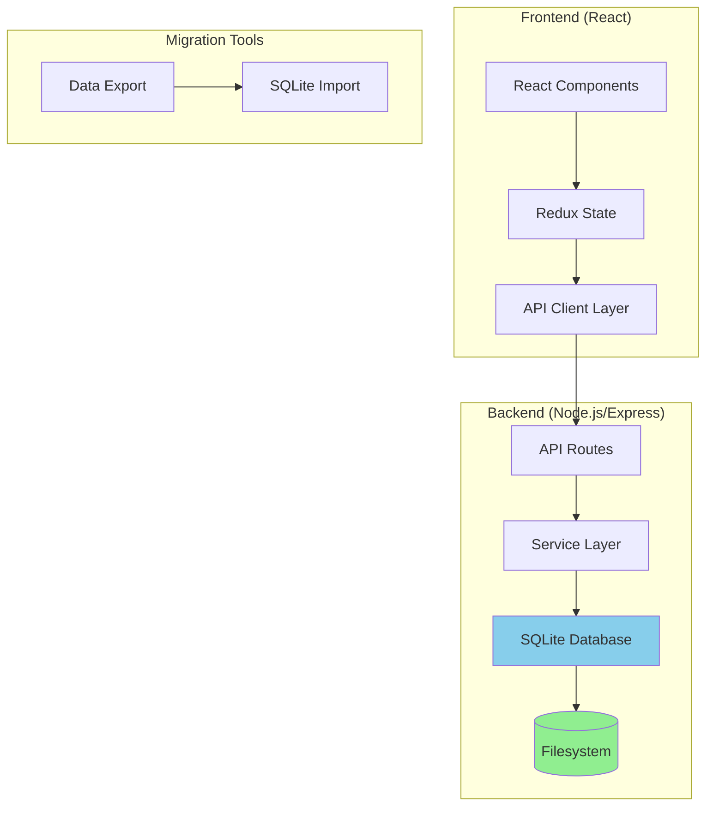
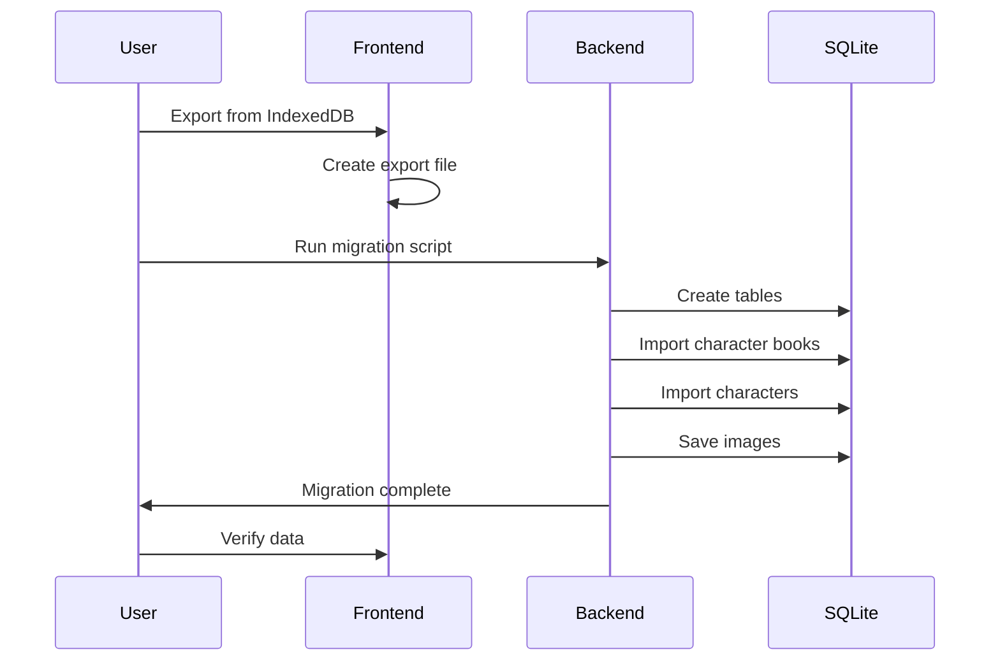

# Migration Plan: IndexedDB to SQLite Filesystem Storage

## Overview

This document outlines a comprehensive plan to migrate the Character Tools application from browser-based IndexedDB storage (via Dexie) to persistent filesystem storage using SQLite.

---

## Problem Statement

**Current Issue:** Characters and CharacterBooks are stored in the browser's IndexedDB, which has several limitations:
- Data is lost when clearing browser data/cache
- Data is browser-specific and not portable
- Limited storage quotas (typically 50-250MB depending on browser)
- No easy backup/restore across devices
- Risk of data loss from browser updates or crashes

**Solution:** Migrate to SQLite database stored on the filesystem, providing:
- Persistent storage that survives browser data clearing
- Easy backup/restore via file copying
- Unlimited storage capacity
- Cross-device compatibility
- Better data integrity and recovery options

---

## Architecture Overview



---

## Technology Stack

### Backend Components

| Component | Technology | Purpose |
|-----------|------------|---------|
| Runtime | Node.js 20+ | Backend runtime |
| Framework | Express.js | REST API server |
| Database | SQLite3 | Persistent storage |
| ORM | better-sqlite3 | Synchronous SQLite driver |
| Validation | Zod | Request/response validation |
| Authentication | JWT (optional) | API security |
| File Upload | Multer | Image handling |

### Frontend Changes

| Component | Change | Purpose |
|-----------|--------|---------|
| API Client | Axios/Fetch | Replace Dexie calls |
| State | Redux (unchanged) | Keep existing state management |
| Services | New API services | Replace database services |

---

## Phase 1: Backend Setup

### 1.1 Project Structure

```
character-tools/
├── backend/
│   ├── src/
│   │   ├── config/
│   │   │   └── database.ts          # SQLite connection
│   │   ├── controllers/
│   │   │   ├── characterController.ts
│   │   │   └── characterBookController.ts
│   │   ├── models/
│   │   │   ├── character.ts
│   │   │   └── characterBook.ts
│   │   ├── routes/
│   │   │   ├── characters.ts
│   │   │   └── characterBooks.ts
│   │   ├── services/
│   │   │   ├── characterService.ts
│   │   │   └── characterBookService.ts
│   │   ├── middleware/
│   │   │   ├── errorHandler.ts
│   │   │   └── validation.ts
│   │   ├── migrations/
│   │   │   └── 001_initial_schema.sql
│   │   ├── types/
│   │   │   └── index.ts
│   │   └── index.ts                 # Server entry point
│   ├── data/                        # SQLite database file location
│   │   └── character-tools.db
│   ├── uploads/                     # Image uploads
│   ├── package.json
│   └── tsconfig.json
├── frontend/                        # Existing React app
└── plans/
```

### 1.2 Backend Dependencies

```json
{
  "dependencies": {
    "express": "^4.18.0",
    "better-sqlite3": "^9.0.0",
    "cors": "^2.8.5",
    "multer": "^1.4.5",
    "zod": "^3.24.0",
    "jsonwebtoken": "^9.0.0",
    "bcrypt": "^5.1.0",
    "dotenv": "^16.3.0"
  },
  "devDependencies": {
    "@types/express": "^4.17.0",
    "@types/node": "^20.0.0",
    "typescript": "^5.8.0",
    "ts-node": "^10.9.0"
  }
}
```

### 1.3 Database Schema

```sql
-- migrations/001_initial_schema.sql

-- Characters table
CREATE TABLE IF NOT EXISTS characters (
    id TEXT PRIMARY KEY,
    name TEXT NOT NULL,
    description TEXT,
    personality TEXT,
    mes_example TEXT,
    scenario TEXT,
    first_mes TEXT,
    alternate_greetings TEXT, -- JSON array
    creator TEXT,
    creator_notes TEXT,
    character_version TEXT,
    tags TEXT, -- JSON array
    system_prompt TEXT,
    post_history_instructions TEXT,
    character_book_id TEXT,
    extensions TEXT, -- JSON object
    image_path TEXT,
    created_at DATETIME DEFAULT CURRENT_TIMESTAMP,
    updated_at DATETIME DEFAULT CURRENT_TIMESTAMP,
    FOREIGN KEY (character_book_id) REFERENCES character_books(id) ON DELETE SET NULL
);

-- Character Books table
CREATE TABLE IF NOT EXISTS character_books (
    id TEXT PRIMARY KEY,
    name TEXT NOT NULL,
    description TEXT,
    scan_depth INTEGER,
    token_budget INTEGER,
    recursive_scanning INTEGER, -- Boolean as 0/1
    extensions TEXT, -- JSON object
    created_at DATETIME DEFAULT CURRENT_TIMESTAMP,
    updated_at DATETIME DEFAULT CURRENT_TIMESTAMP
);

-- Character Book Entries table
CREATE TABLE IF NOT EXISTS character_book_entries (
    id INTEGER PRIMARY KEY AUTOINCREMENT,
    character_book_id TEXT NOT NULL,
    name TEXT,
    comment TEXT,
    enabled INTEGER DEFAULT 1, -- Boolean as 0/1
    case_sensitive INTEGER DEFAULT 0,
    selective INTEGER DEFAULT 0,
    constant INTEGER DEFAULT 0,
    position TEXT, -- 'before_char' or 'after_char'
    keys TEXT, -- JSON array
    secondary_keys TEXT, -- JSON array
    content TEXT,
    insertion_order INTEGER,
    priority INTEGER,
    extensions TEXT, -- JSON object
    created_at DATETIME DEFAULT CURRENT_TIMESTAMP,
    updated_at DATETIME DEFAULT CURRENT_TIMESTAMP,
    FOREIGN KEY (character_book_id) REFERENCES character_books(id) ON DELETE CASCADE
);

-- Indexes for performance
CREATE INDEX IF NOT EXISTS idx_characters_name ON characters(name);
CREATE INDEX IF NOT EXISTS idx_characters_creator ON characters(creator);
CREATE INDEX IF NOT EXISTS idx_characters_tags ON characters(tags);
CREATE INDEX IF NOT EXISTS idx_character_books_name ON character_books(name);
CREATE INDEX IF NOT EXISTS idx_character_book_entries_book_id ON character_book_entries(character_book_id);
```

---

## Phase 2: API Design

### 2.1 REST API Endpoints

#### Characters API

```
GET    /api/characters              - List all characters
GET    /api/characters/:id          - Get single character
POST   /api/characters              - Create character
PUT    /api/characters/:id          - Update character
DELETE /api/characters/:id          - Delete character
POST   /api/characters/import       - Import character(s) from file
GET    /api/characters/:id/export  - Export character as JSON/PNG
POST   /api/characters/:id/image    - Upload character image
GET    /api/characters/:id/image    - Get character image
```

#### Character Books API

```
GET    /api/character-books              - List all character books
GET    /api/character-books/:id          - Get single character book
POST   /api/character-books              - Create character book
PUT    /api/character-books/:id          - Update character book
DELETE /api/character-books/:id          - Delete character book
POST   /api/character-books/import       - Import character book(s)
GET    /api/character-books/:id/export   - Export character book
GET    /api/character-books/:id/entries   - Get book entries
POST   /api/character-books/:id/entries   - Add entry to book
PUT    /api/character-books/:id/entries/:entryId  - Update entry
DELETE /api/character-books/:id/entries/:entryId  - Delete entry
```

#### Database Management API

```
GET    /api/database/export      - Export entire database
POST   /api/database/import      - Import database
DELETE /api/database             - Clear all data
GET    /api/database/backup      - Create backup
GET    /api/database/info        - Get database statistics
```

### 2.2 API Response Format

```typescript
// Success Response
{
  success: true,
  data: { /* response data */ },
  meta?: {
    page?: number,
    limit?: number,
    total?: number
  }
}

// Error Response
{
  success: false,
  error: {
    code: string,
    message: string,
    details?: any
  }
}
```

---

## Phase 3: Frontend Changes

### 3.1 Replace Dexie with API Client

Create new API client layer to replace Dexie calls:

```typescript
// src/services/api/characterApi.ts
import axios from 'axios'

const api = axios.create({
  baseURL: import.meta.env.VITE_API_URL || 'http://localhost:3000/api',
  headers: {
    'Content-Type': 'application/json'
  }
})

export const characterApi = {
  getAll: async () => {
    const response = await api.get('/characters')
    return response.data.data
  },

  getById: async (id: string) => {
    const response = await api.get(`/characters/${id}`)
    return response.data.data
  },

  create: async (character: CharacterEditorState) => {
    const response = await api.post('/characters', character)
    return response.data.data
  },

  update: async (id: string, character: Partial<CharacterEditorState>) => {
    const response = await api.put(`/characters/${id}`, character)
    return response.data.data
  },

  delete: async (id: string) => {
    await api.delete(`/characters/${id}`)
  },

  // ... other methods
}
```

### 3.2 Update Components

Replace Dexie hooks with API calls:

```typescript
// Before (Dexie)
const characters = useLiveQuery(() => dataBase.characters.toArray())

// After (API)
const [characters, setCharacters] = useState<CharacterDatabaseData[]>([])
const [loading, setLoading] = useState(true)

useEffect(() => {
  characterApi.getAll().then(setCharacters).finally(() => setLoading(false))
}, [])
```

### 3.3 Environment Configuration

```typescript
// .env.development
VITE_API_URL=http://localhost:3000/api

// .env.production
VITE_API_URL=/api
```

---

## Phase 4: Data Migration

### 4.1 Migration Tool

Create a migration utility to export from IndexedDB and import to SQLite:

```typescript
// backend/src/scripts/migrateFromIndexedDB.ts
import Database from 'better-sqlite3'
import { v4 as uuidv4 } from 'uuid'

interface IndexedDBExport {
  characters: any[]
  characterBooks: any[]
}

async function migrateData(exportFile: string) {
  const db = new Database('./data/character-tools.db')
  const exportData: IndexedDBExport = JSON.parse(
    require('fs').readFileSync(exportFile, 'utf-8')
  )

  // Migrate character books first
  const insertBook = db.prepare(`
    INSERT INTO character_books (
      id, name, description, scan_depth, token_budget,
      recursive_scanning, extensions
    ) VALUES (?, ?, ?, ?, ?, ?, ?)
  `)

  const bookIdMap = new Map()

  for (const book of exportData.characterBooks) {
    const newId = uuidv4()
    bookIdMap.set(book.id, newId)

    insertBook.run(
      newId,
      book.name,
      book.description || null,
      book.scan_depth || null,
      book.token_budget || null,
      book.recursive_scanning ? 1 : 0,
      JSON.stringify(book.extensions || {})
    )

    // Migrate entries
    const insertEntry = db.prepare(`
      INSERT INTO character_book_entries (
        character_book_id, name, comment, enabled, case_sensitive,
        selective, constant, position, keys, secondary_keys,
        content, insertion_order, priority, extensions
      ) VALUES (?, ?, ?, ?, ?, ?, ?, ?, ?, ?, ?, ?, ?, ?)
    `)

    for (const entry of book.entries) {
      insertEntry.run(
        newId,
        entry.name || null,
        entry.comment || null,
        entry.enabled ? 1 : 0,
        entry.case_sensitive ? 1 : 0,
        entry.selective ? 1 : 0,
        entry.constant ? 1 : 0,
        entry.position || 'after_char',
        JSON.stringify(entry.keys || []),
        JSON.stringify(entry.secondary_keys || []),
        entry.content,
        entry.insertion_order,
        entry.priority || null,
        JSON.stringify(entry.extensions || {})
      )
    }
  }

  // Migrate characters
  const insertCharacter = db.prepare(`
    INSERT INTO characters (
      id, name, description, personality, mes_example, scenario,
      first_mes, alternate_greetings, creator, creator_notes,
      character_version, tags, system_prompt, post_history_instructions,
      character_book_id, extensions, image_path
    ) VALUES (?, ?, ?, ?, ?, ?, ?, ?, ?, ?, ?, ?, ?, ?, ?, ?, ?)
  `)

  for (const character of exportData.characters) {
    const newId = uuidv4()
    const bookId = character.character_book ? bookIdMap.get(character.character_book) : null

    insertCharacter.run(
      newId,
      character.name,
      character.description || null,
      character.personality || null,
      character.mes_example || null,
      character.scenario || null,
      character.first_mes || null,
      JSON.stringify(character.alternate_greetings || []),
      character.creator || null,
      character.creator_notes || null,
      character.character_version || null,
      JSON.stringify(character.tags || []),
      character.system_prompt || null,
      character.post_history_instructions || null,
      bookId,
      JSON.stringify(character.extensions || {}),
      character.image ? `uploads/${newId}.png` : null
    )

    // Save image if exists
    if (character.image) {
      const base64Data = character.image.replace(/^data:image\/\w+;base64,/, '')
      require('fs').writeFileSync(
        `./uploads/${newId}.png`,
        Buffer.from(base64Data, 'base64')
      )
    }
  }

  console.log('Migration completed successfully!')
  db.close()
}

// Run migration
migrateData(process.argv[2])
```

### 4.2 Migration Steps



---

## Phase 5: Deployment

### 5.1 Development Setup

```bash
# Backend
cd backend
npm install
npm run dev  # Runs on port 3000

# Frontend (in new terminal)
cd frontend
npm install
npm run dev  # Runs on port 5173
```

### 5.2 Production Build

```bash
# Build backend
cd backend
npm run build
npm start  # Production server

# Build frontend
cd frontend
npm run build
# Serve dist folder with nginx or similar
```

### 5.3 Docker Deployment (Optional)

```dockerfile
# Dockerfile
FROM node:20-alpine

WORKDIR /app

# Backend
COPY backend/package*.json ./backend/
RUN cd backend && npm ci --production
COPY backend ./backend

# Frontend build
COPY frontend/package*.json ./frontend/
RUN cd frontend && npm ci
COPY frontend ./frontend
RUN cd frontend && npm run build

EXPOSE 3000
CMD ["node", "backend/dist/index.js"]
```

---

## Phase 6: Testing Strategy

### 6.1 Backend Testing

```typescript
// tests/characterApi.test.ts
import request from 'supertest'
import app from '../src/index'

describe('Character API', () => {
  it('should create a character', async () => {
    const response = await request(app)
      .post('/api/characters')
      .send({
        name: 'Test Character',
        description: 'A test character'
      })

    expect(response.status).toBe(201)
    expect(response.body.data.name).toBe('Test Character')
  })

  it('should get all characters', async () => {
    const response = await request(app)
      .get('/api/characters')

    expect(response.status).toBe(200)
    expect(Array.isArray(response.body.data)).toBe(true)
  })
})
```

### 6.2 Frontend Testing

Update existing tests to use mocked API instead of Dexie.

### 6.3 Integration Testing

Test the complete flow from frontend to backend database.

---

## Phase 7: Rollback Plan

### 7.1 Keep IndexedDB as Fallback

Maintain the ability to switch back to IndexedDB:

```typescript
// src/config/storage.ts
export const STORAGE_MODE = import.meta.env.VITE_STORAGE_MODE || 'api'

// Use conditional logic
if (STORAGE_MODE === 'indexeddb') {
  // Use Dexie
} else {
  // Use API
}
```

### 7.2 Data Backup

Before migration:
1. Export all data from IndexedDB
2. Save export file in multiple locations
3. Verify export integrity

---

## Implementation Checklist

### Phase 1: Backend Setup
- [ ] Create backend directory structure
- [ ] Initialize Node.js project
- [ ] Install dependencies
- [ ] Set up TypeScript configuration
- [ ] Create database schema
- [ ] Set up SQLite connection
- [ ] Create base Express server

### Phase 2: API Implementation
- [ ] Implement character CRUD endpoints
- [ ] Implement character book CRUD endpoints
- [ ] Implement entry management endpoints
- [ ] Implement image upload/download
- [ ] Add validation middleware
- [ ] Add error handling
- [ ] Add CORS configuration

### Phase 3: Frontend Refactoring
- [ ] Create API client layer
- [ ] Replace Dexie calls with API calls
- [ ] Update all components using database
- [ ] Add loading states
- [ ] Add error handling
- [ ] Update environment configuration

### Phase 4: Migration
- [ ] Create export utility from IndexedDB
- [ ] Create import utility to SQLite
- [ ] Test migration with sample data
- [ ] Document migration process

### Phase 5: Testing
- [ ] Write unit tests for backend
- [ ] Write integration tests
- [ ] Update frontend tests
- [ ] Perform end-to-end testing

### Phase 6: Deployment
- [ ] Set up production build
- [ ] Configure environment variables
- [ ] Set up reverse proxy (nginx)
- [ ] Configure SSL (optional)
- [ ] Set up backup strategy

### Phase 7: Documentation
- [ ] Update README
- [ ] Document API endpoints
- [ ] Create migration guide
- [ ] Update deployment docs

---

## Estimated Timeline

| Phase | Tasks | Notes |
|-------|-------|-------|
| Phase 1 | Backend Setup | 2-3 days |
| Phase 2 | API Implementation | 5-7 days |
| Phase 3 | Frontend Refactoring | 5-7 days |
| Phase 4 | Migration | 2-3 days |
| Phase 5 | Testing | 3-4 days |
| Phase 6 | Deployment | 1-2 days |
| Phase 7 | Documentation | 1-2 days |

**Total:** ~19-28 days

---

## Risks & Mitigations

| Risk | Impact | Mitigation |
|------|--------|------------|
| Data loss during migration | High | Backup before migration, test with sample data |
| API performance issues | Medium | Add caching, optimize queries, add indexes |
| Breaking changes for users | Medium | Provide migration guide, support both modes temporarily |
| Increased complexity | Medium | Document thoroughly, keep API simple |
| Deployment issues | Low | Use Docker for consistency, test deployment locally |

---

## Next Steps

1. **Review this plan** and confirm the approach
2. **Set up backend project structure**
3. **Implement Phase 1** (Backend Setup)
4. **Test basic API endpoints**
5. **Proceed with Phase 2** (API Implementation)

Would you like me to switch to Code mode to start implementing this migration plan?
